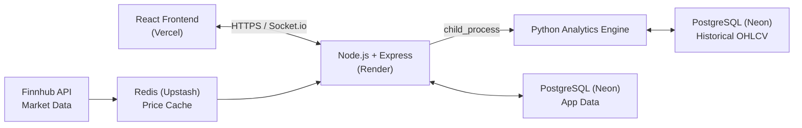

# TradeX

A real-time paper trading platform where users can practice trading stocks with live market data, without risking real money.

**Live Demo:** https://trade-x-taupe.vercel.app<br>
**API:** https://tradex-6t26.onrender.com

---

## Overview

TradeX is a full-stack trading simulator built to demonstrate production-style engineering patterns — authentication, real-time data, atomic financial transactions, and role-based access control — using a stack that mirrors what fintech companies actually build with.

Every user starts with $100,000 in virtual cash and can buy/sell stocks at live market prices, track their portfolio's real-time profit and loss, and view technical analysis (RSI, MACD, Sharpe ratio) powered by a separate Python analytics engine.

---

## Features

- **Authentication** — Email/password (bcrypt-hashed) and Google OAuth2, JWT stored in HttpOnly cookies
- **Role-based access control** — Admin and Trader roles, enforced at the middleware level on the backend
- **Real-time prices** — Live stock prices via Finnhub, cached in Redis, broadcast to all connected clients via Socket.io
- **Trading engine** — Buy/sell orders processed inside atomic PostgreSQL transactions, with weighted average cost-basis tracking
- **Portfolio tracking** — Live P&L, total invested, percentage return, and an allocation breakdown chart
- **Technical analysis** — RSI, MACD, Sharpe ratio, and max drawdown computed by a Python engine (pandas + `ta`), bridged into the Node.js API via `child_process`
- **Admin panel** — Add/remove stocks (with live price feed auto-subscription), manage users, view platform-wide stats
- **Transaction history** — Full record of every trade, most recent first

---

## Tech Stack

**Frontend:** React (Vite), Tailwind CSS, React Router, Recharts, Socket.io-client, Axios

**Backend:** Node.js, Express, PostgreSQL (raw SQL via `pg`), Redis (Upstash), Socket.io, JWT, Passport.js (Google OAuth2), bcrypt

**Analytics:** Python, pandas, `ta`, SQLAlchemy

**Infrastructure:** Neon (PostgreSQL), Upstash (Redis), Finnhub (market data), Render (backend), Vercel (frontend)

---

## 🏗️ Architecture



The Node.js server maintains a single upstream connection to Finnhub and re-broadcasts price updates to all connected frontend clients via Socket.io — regardless of user count, there's only ever one outgoing connection to the external market data provider.

---

## 📁 Project Structure

```text
stock-trading-platform/
├── client/                 # React frontend (Vite)
├── server/                 # Node.js + Express backend
├── analytics/              # Python analytics engine
├── docs/
│   ├── API.md              # REST API documentation
│   └── SCHEMA.md           # Database schema documentation
└── README.md
```
---

## Running Locally

**Prerequisites:** Node.js 18+, Python 3.9+, a PostgreSQL database (e.g. Neon), a Redis instance (e.g. Upstash), a Finnhub API key, Google OAuth credentials.

### 1. Clone and install

```bash
git clone https://github.com/AdarshSiingh/TradeX.git
cd TradeX

cd server && npm install
cd ../client && npm install
cd ../analytics && python3 -m venv venv && source venv/bin/activate && pip install -r requirements.txt
```

### 2. Environment variables

Copy the example files and fill in your own credentials:

```bash
cp server/.env.example server/.env
cp analytics/.env.example analytics/.env
cp client/.env.example client/.env
```

### 3. Run each service

```bash
# Terminal 1 — backend
cd server && npm run dev

# Terminal 2 — frontend
cd client && npm run dev
```

The backend runs on `http://localhost:8000`, frontend on `http://localhost:5173`. Database tables are created automatically on first server startup.

---

## Documentation

- [API Reference](./docs/API.md) — every endpoint, request/response shapes, auth requirements
- [Database Schema](./docs/SCHEMA.md) — table structures, relationships, and design decisions

---

## Key Engineering Decisions

**Atomic transactions for trades** — every buy/sell wraps balance updates, portfolio updates, and record-keeping in a single PostgreSQL transaction (`BEGIN`/`COMMIT`/`ROLLBACK`), so a partial failure never leaves a user's data in an inconsistent state.

**Raw SQL over an ORM** — chosen deliberately for direct control over queries (like the JOIN-based P&L calculation) and to keep SQL fluency visible in the codebase.

**Redis as a speed layer, not a replacement for the database** — Finnhub's high-frequency price ticks are absorbed by Redis; PostgreSQL holds the durable source of truth.

**Separate `orders` and `transactions` tables** — an order represents intent, a transaction represents the executed financial record. Currently every order executes immediately, but this separation leaves room for features like limit orders without restructuring the schema.

---

## Author

Built by Adarsh — a BTech Information Technology student, as a full-stack portfolio project.
